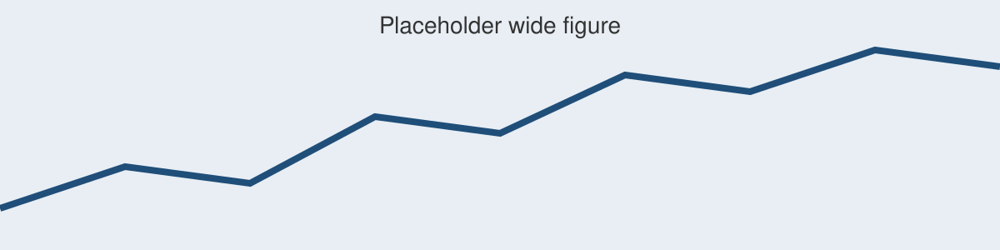

# Independent title and heading styles

`poster.theme-overrides` overlays any theme element by name. It merges into
the element rather than replacing it, so naming a size does not drop the font
and fill the theme already set.

## Size tiers are reachable too

Computed sizes are merged *under* the theme dict, so an explicit `size:` in
`heading-text-args` wins over the built-in `1.6 ×` relationship. An 80 pt
title, 38 pt section bars, and 28 pt body now coexist.

::: {.poster-surface}
`.poster-surface` groups related content on a tint without colouring the whole
column. With no attributes it takes the theme's surface.
:::

::: {.poster-surface tint="#0D3B66" ink="#FFFFFF" pad="0.35in"}
**tint and ink travel together.** A dark surface needs its own text colour,
and markdown has no other way to reach it. Avoid inline code on a dark
surface: Quarto's highlighter paints those tokens a fixed dark colour that
ink cannot override.
:::

::: {.col-break}
:::

# Code at poster scale

```r
design <- creel_design(calendar, date = date, strata = day_type) |>
  add_counts(counts)

estimate_effort(design, by = "day_type")
```

Set `code-font-size` and `code-fonts` under `poster:`. Leaving them unset
changes nothing: code inherits the body size and Typst's own mono face, which
is what every poster written before these options did.

# Aligned cells, not column flow

A poster column is a single stream. Two columns line up only when their
content happens to fill to the same height, and nothing an author writes makes
that reliable. `.poster-grid` lays its children out as real grid cells, so a
row is a row.

::: {.poster-grid widths="1fr,1.4fr" gutter="0.4in"}
::: {.poster-surface}
**Left cell.** Its top edge shares a row with the cell beside it, whatever
either one contains.
:::

::: {.poster-surface}
**Right cell.** Wider, by `widths`. Give `cols` instead for equal fractions,
and wrap the whole div in `.full-width` to align across the poster.
:::
:::

# Centred evidence

`stats-align: center` centres the cells of the evidence strip. Left is the
default, and reads better when the labels run past one line.

::: {.stats label="At a glance"}
**3** poster sizes

**11** theme elements

**0** forks required
:::

::: {.col-break}
:::

# Framing an image

`.poster-image-frame` is the same primitive with a rule and a mat. It exists
because a dark cover or photograph dropped straight onto a pale poster prints
as a muddy block.

::: {.poster-image-frame pad="0.3in"}

:::

# What is still out of reach

Cross-column alignment in *flowing* content. `.poster-grid` gives alignment by
leaving the flow model, which is the only way Typst offers. There is no way to
anchor a box in one flowing column to a step in the next.

Inline code on a dark `tint`. Quarto's syntax highlighter emits each token
with an explicit fill, which beats `ink`.

## Elements `theme-overrides` can name

| Element | Reaches |
|---|---|
| `title-box-args` / `title-text-args` | The title bar, independent of headings |
| `heading-box-args` / `heading-text-args` | Level-1 section bars |
| `subheading-box-args` / `subheading-text-args` | Level-2 headings |
| `box-args`, `alert-box-args` | Poster boxes and their variants |
| `takeaway-box-args`, `takeaway-quiet-box-args` | Both takeaway kinds |
| `stats-box-args`, `stat-value-text-args` | The evidence strip |
| `surface-box-args`, `frame-box-args` | Surfaces and image frames |
| `code-text-args` | Code, when the shorthands are not enough |
| `footer-box-args`, `caption-text-args` | Footer bar and figure captions |

::: {.takeaway .quiet label="Rule of thumb" scale="1.2"}
Reach for the grid when two things must line up. Leave the flow alone when
they merely both exist.
:::
